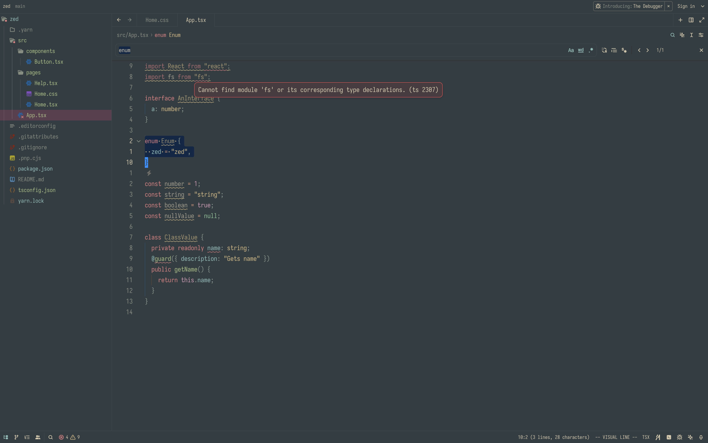

# 🌲 Forest Night theme for Zed Editor

Forest Night is a green based color scheme.

It's designed to be warm and soft in order to protect developers' eyes

  

## Usage

1. Open Zed.
2. Open the command palette (<kbd>Cmd</kbd>+<kbd>Shift</kbd>+<kbd>P</kbd>) and enter _zed: extensions_.
3. Search for the _Forest Night_ extension and install.
4. Enter _theme selector: toggle_ in the command palette and select the Forest Night theme in the dropdown.

## Thanks to

- [@jef](https://github.com/jef) for [Forest Night for Jetbrains](https://github.com/jef/forest-night-jetbrains)
- [@Cosmeak](https://github.com/Cosmeak) for [Everforest Zed](https://github.com/Cosmeak/everforest-zed)
